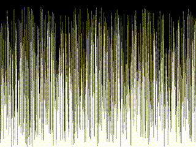

# Data Sorting Visualiser

---

---
## Overview
A visual tool that demonstrates sorting algorithms using SDL2. This program shows the step-by-step process of various sorting algorithms as they sort a randomly generated array of bars.

## Features

- **Multiple Sorting Algorithms**: Implements and visualises different sorting algorithms
- **Interactive Controls**: Pause/resume sorting, reset array, and choose algorithms
- **Real-time Visualisation**: Shows the sorting process with highlighted elements
- **Algorithm Comparison**: Easily compare the efficiency and behavior of different sorting methods

## Dependencies

```SDL2, libc```

## Usage

Run the program with:
```bash
make && ./bin/sorting_visualiser
```

Controls:
- **q**: Quit the application
- **r**: Reset the array with new random values
- **p**: Pause/resume sorting
- **1**: Bubble Sort
- **2**: Insertion Sort
- **3**: Selection Sort
- **4**: Quick Sort
- **5**: Merge Sort
- **6**: Heap Sort
- **7**: Shell Sort
- **8**: Radix Sort
- **9**: Bucket Sort
